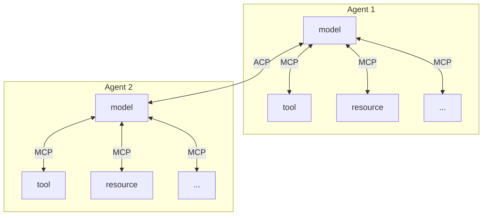

## Model Context Protocol

[**Model Context Protocol (MCP**](https://modelcontextprotocol.io/introduction)**)** is a popular open standard from Anthropic that provides AI **models** (usually LLMs) with **context**: resources, tools, etc. MCP operates effectively within the bounds of a "single agent", since it enables the connection between the LLM and its tools/resources.

On the other hand, Agent Communication Protocol (ACP) is a protocol that enables **communication** between **agents**.

MCP and ACP work together to build powerful agentic systems, as shown below:

## Agent2Agent Protocol

The Agent Communication Protocol (ACP) launched by IBM in March 2025 and [Agent2Agent Protocol (A2A)](https://github.com/google/A2A), launched by Google in April 2025, both aim to create a standard interface for agent-to-agent communication.

Advantages of ACP include:

- **Open Governance**: Managed through the Linux Foundation.
- **Co-developed with BeeAI**: An open platform to manage the agent lifecycle, including installation, running, registration, and sharing of agents.
- **REST-based Communication**: Enables lightweight, runtime-free agent invocation and scalable system integration.
- **Offline Agent Discovery**: Agents are packaged with details at build time. Note: BeeAI provides an open registry implementation.
- **Message Structure**: The MIME-type-based message structure in ACP is designed to be extensible and flexible, as opposed to the pre-defined types.
- **Agent Support**: Compatible with any agent, from small, stateless, serverless utility agents to long-running, stateful conversational agents.
- **Native SDK**: Allows users to wrap an agent and create a server, provides tooling for session management, and handles agent state management.