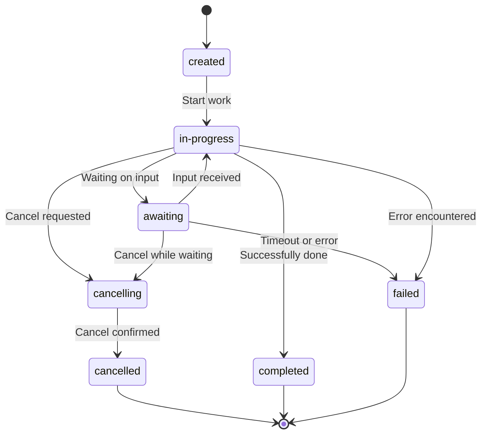

The Agent Communication Protocol (ACP) defines a structured lifecycle that guides agents from initial configuration through execution and completion. Understanding this lifecycle is key to effectively managing agent interactions and handling the different states agents transition through.

## Lifecycle Phases

At a high level, an ACP agent's lifecycle consists of these key phases:
1. **Configuration** - Define capabilities and behavior
2. **Deployment** - Make the agent available for use
3. **Execution** - Process requests and generate responses
4. **Persistence** - Maintain state across interactions
5. **Termination** - Complete processing and release resources

## Configuration

Configuration is where you define an agent's capabilities, behavior, and API contract. In the ACP Python SDK, this is implemented using the `@agent()` decorator pattern.

```python echo.py
@server.agent()
async def echo(input: list[Message], context: Context) -> AsyncGenerator[RunYield, RunYieldResume]:
    """Echoes everything"""
    # Agent implementation here
```

The configuration establishes several critical aspects of the agent:
- **Function Definition:** The core functionality that determines what the agent does
- **Input Parameter:** The `input` parameter accepts a list of `Message` objects
- **Context Parameter:** The `context` parameter provides access to the execution environment
- **Return Type:** The `AsyncGenerator[RunYield, RunYieldResume]` return type enables both streaming responses and the await pattern
- **Documentation:** The docstring provides a human-readable description of the agent

The configuration phase determines how the agent will be discovered, accessed, and understood by other systems in the ACP ecosystem. For a complete reference of all configuration parameters, please refer to the [Agent Detail](/core-concepts/agent-detail) documentation page.

## Deployment

Deployment activates your configured agent and makes it available to clients. Agent configurations can be associated with either a built-in server or used with external ASGI servers.

### Built-in Server Deployment

The simplest approach uses the SDK's built-in server:

```python echo.py
import asyncio
from collections.abc import AsyncGenerator

from acp_sdk.models import (
    Message,
)
from acp_sdk.server import Context, RunYield, RunYieldResume, Server

server = Server()


@server.agent()
async def echo(input: list[Message], context: Context) -> AsyncGenerator[RunYield, RunYieldResume]:
    """Echoes everything"""
    for message in input:
        await asyncio.sleep(0.5)
        yield {"thought": "I should echo everything"}
        await asyncio.sleep(0.5)
        yield message


server.run() # Starts the server on the default port
# Source: python/examples/servers/echo.py
```

This handles HTTP routing, ASGI server configuration, and agent registration in a single step.

### Standalone ASGI Application

For integration with external ASGI servers, the SDK offers application factory functions:

```python standalone.py
from collections.abc import AsyncGenerator

from acp_sdk.models import (
    Message,
)
from acp_sdk.server import RunYield, RunYieldResume, agent, create_app

# This example demonstrates how to serve agents with you own server


@agent()
async def echo(input: list[Message]) -> AsyncGenerator[RunYield, RunYieldResume]:
    """Echoes everything"""
    for message in input:
        yield message


app = create_app(echo)

# The app can now be used with any ASGI server

# Run with
#   1. fastapi run examples/servers/standalone.py
#   2. uvicorn examples.servers.standalone:app
#   ...
# Source: python/examples/servers/standalone.py
```

This approach separates the agent definition from the server implementation, providing more flexibility for production deployments.

## Execution

Execution is when your agent actively processes requests and generates responses. The ACP SDK supports several execution patterns:

### Synchronous Execution

The client's `run_sync` method executes an agent and waits for the complete response:

```python
run = await client.run_sync(agent="echo", input=[Message(parts=[MessagePart(content="Howdy!")])])
```

### Streaming Execution

The `run_stream` method delivers incremental updates as the agent processes:

```python
async for event in client.run_stream(agent="echo", input=[Message(parts=[MessagePart(content="Howdy!")])]):
    print(event)
```

Inside the agent function, execution happens as the agent processes input and yields results.

## Agent Runs and State Management

Individual agent executions are managed through "Agent Runs," which can be part of a session and inherit its history. ACP provides specific API endpoints for managing execution lifecycle:

| **Method**               | **Endpoint**                  | **Description**                                                                                         |
|--------------------------|-------------------------------|---------------------------------------------------------------------------------------------------------|
| `POST`                   | `/runs`                       | Initiates a new agent run. Requires `agent_name`, `input`. Optional: `session_id`, `mode` (`sync`, `async`, `stream`). Returns the initial `Run` object or stream. |
| `GET`                    | `/runs/{run_id}`              | Retrieves the current state and details of a specific agent run.                                       |
| `POST`                   | `/runs/{run_id}`              | Resumes an agent run in the `awaiting` state. Requires `await_resume` data. Optional: `mode` for the response. |
| `POST`                   | `/runs/{run_id}/cancel`       | Requests cancellation of an ongoing agent run. Returns `202 Accepted` if cancellation is initiated.    |

### Run States

Agent Runs transition through the following states:



Each run begins in the `created` state and transitions to `in-progress` after receiving input. While in progress, it can:

- Enter the `awaiting` state when requiring external input
- Complete successfully and enter the `completed` state
- Be cancelled and enter `cancelling` followed by cancelled
- Encounter an error and enter the `failed` state

Some agent implementations may allow continuing from certain terminal states back to `in-progress`.

## Persistence and memory

Persistence refers to how agents maintain state across interactions. The ACP SDK implements two key persistence mechanisms:

### Multi-turn (session-based)

State can be preserved across multiple agent runs using sessions. The client can create a session to ensure the agent is maintaining the internal state between runs, and thus holding a continuous conversation.

When using the ACP SDK, the `input` argument will contain the full session history from all the previous runs in the same session. `context.session_id` holds the session id, allowing agents to store additional session-related data.

```python multi_turn.py
@server.agent()
async def multi_turn(input: list[Message], context: Context) -> AsyncGenerator[RunYield, RunYieldResume]:
    ... # `input` has the full history, `context.session_id` can be used to reference extra data
```

On the client, a session can be used like this:

```python session.py
async with Client(base_url="http://localhost:8000") as client, client.session() as session:
    # First interaction
    run = await session.run_sync(agent="echo", input=[Message(parts=[MessagePart(content="Howdy!")])])
    # Second interaction in same session
    run = await session.run_sync(agent="echo", input=[Message(parts=[MessagePart(content="Howdy again!")])])
```

### Single-turn (await)

The await pattern enables back-and-forth interactions within a single agent run:

```python awaiting.py
@server.agent()
async def awaiting(input: list[Message], context: Context) -> AsyncGenerator[RunYield, RunYieldResume]:
    """Greets and awaits for more data"""
    yield MessagePart(content="Hello!")
    
    # Pause execution and request specific information
    resume = yield MessageAwaitRequest(
        message=Message(parts=[MessagePart(content="Can you provide me with additional configuration?")])
    )
    
    # Resume with the new information
    assert isinstance(resume, MessageAwaitResume)
    yield MessagePart(content=f"Thanks for config: {resume.message}")
```

This pattern allows the agent to begin processing with initial input, pause execution when it requires additional information, request that information, and resume from where it left off once the input is provided.

## Termination

Termination is the final phase in an agent's lifecycle when processing concludes and system resources are released. The ACP SDK supports several types of termination:

1. **Successful Completion.** This is the most common scenario, where the agent processes the input and finishes execution normally. In ACP SDK examples, this happens when the agent function yields all responses and returns control.

2. **Session Termination.** For stateful interactions, termination occurs when a session ends. The SDK uses context managers to ensure all session-related resources are properly released, which is critical for system stability during long-lived or high-volume operations.

3. **Connection Termination.** If a client disconnects (whether intentionally or due to an error) the agent’s execution ends. The SDK’s context management ensures that even unexpected disconnections do not result in lingering tasks or unreleased resources.

The context manager pattern (`async with`) ensures resources are properly released even when errors occur. This is particularly important in production environments with many concurrent agent instances.

By implementing proper termination handling, the ACP SDK helps ensure agents can be safely started, stopped, and managed throughout their lifecycle.
