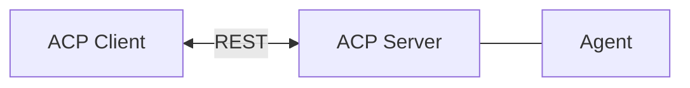
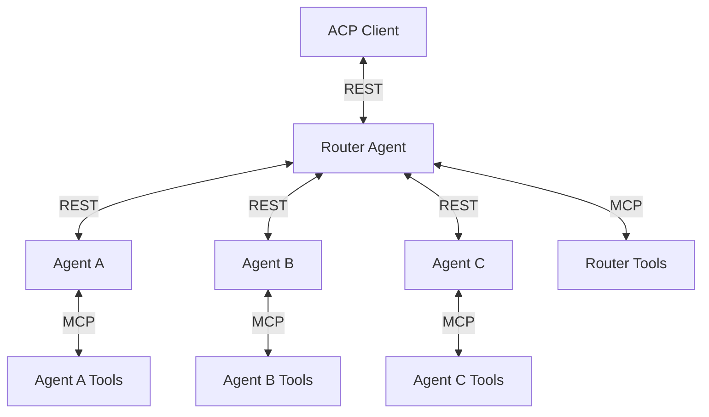

The **Agent Communication Protocol (ACP)** provides a standardized interface for agent communication, enabling seamless interaction between clients and agents, as well as between multiple agents in complex systems. This page explains the architectural patterns that ACP supports, from simple deployments to sophisticated multi-agent ecosystems.

## Basic Single-Agent

ACP provides a simple REST interface to connect a client to a single agent—ideal for direct communication, lightweight setups, and debugging. The ACP Server wraps the agent, translating REST calls into internal logic.

## Advanced Multi-Agent

ACP supports flexible multi-agent architectures for advanced orchestration, specialization, and delegation. A common design is the Router Agent model, where a central agent:
- Acts as both server and client
- Breaks down client requests into sub-tasks
- Routes tasks to specialized agents
- Aggregates responses into a single result
- Uses its own tools and those exposed by downstream agents via the MCP extension

<Note> 
The router pattern is one of many multi-agent designs; ACP supports flexible topologies—agents can be composed, chained, or coordinated to suit your application's needs.
</Note>