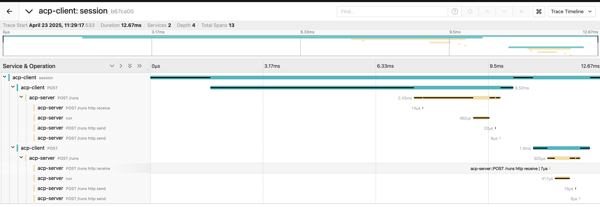
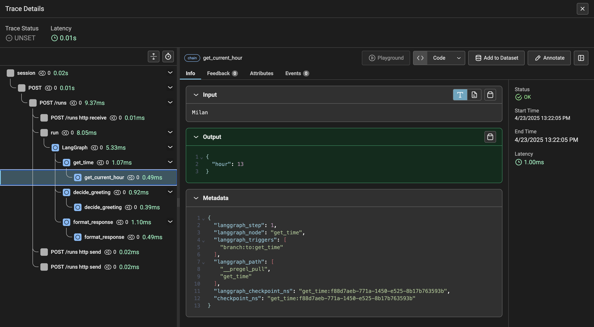

This guide demonstrates how to use the OpenTelemetry instrumentation for debugging. You'll learn how to enable instrumentation for ACP communication and the custom agent and how to debug data in the [OTLP exporters UI](https://opentelemetry.io/docs/languages/js/exporters/#otlp).

## Motivation

Debugging modern agentic systems and distributed applications can be tricky, especially when you're dealing with asynchronous workflows, multiple services, and custom logic layers. OpenTelemetry offers a powerful way to trace and understand these systems in real time. By instrumenting both the ACP communication and agent logic, you gain visibility into how data flows, how decisions are made, and where bottlenecks or errors might occur.

This guide is here to help you set up this instrumentation in practice, showing you how to capture and visualize traces using both general-purpose (Jaeger) and AI-focused (Phoenix) OTLP exporters—so you can debug effectively and with confidence.

## What is OTLP exporter

In the context of the OpenTelemetry framework, an OTLP exporter acts as both a backend for data collection and a **UI** for data visualisation.
In this tutorial I will describe 2 OTLP exporters [Jaeger](https://www.jaegertracing.io/) and [Arize Phoenix](https://phoenix.arize.com/).

### Jaeger

> Use for general purpose

Jaeger is Open source, distributed tracing platform OpenTelemetry data visualization. This tool has base UI and it's not so fancy as Phoenix, but you can see data from all spans and it's not limited to agenting observability.

#### Run Jaeger

```
docker run --rm \
  -e COLLECTOR_ZIPKIN_HOST_PORT=:9411 \
  -p 16686:16686 \
  -p 4317:4317 \
  -p 4318:4318 \
  -p 9411:9411 \
  jaegertracing/all-in-one:latest
```

> open instance on `http://localhost:16686/search` in the browser.

### Phoenix

> AI-focused debugging

Phoenix is an open-source AI observability platform designed for experimentation, evaluation, and troubleshooting by Arize AI company that has its own semantic conventions that all supported frameworks must follow. The advantage is defining more custom attributes for trace's well-visualization and evaluation.

Use Phoenix when your primary focus is agent observability. 

The main disadvantage is that the platform truncates the custom data attributes that are not correctly parsed. You cannot debug the ACP, fastify server, etc...

> By default, Phoenix runs on port **6006**. You can either map this to the standard OTLP port **4318** or update the `OTEL_EXPORTER_OTLP_ENDPOINT` to point to the correct port.

#### Run Phoenix

```
docker run -p 4318:6006 -i -t arizephoenix/phoenix
```

> open instance on `http://localhost:4318/projects` in the browser.

## Base ACP communication example

In this example, we will focus only on the communication between the server and client. 
Let's use the `Jaeger` for this example.

<Warning>
Be sure you have a running Jaeger instance before you start! See the [Run Jaeger](#run-jaeger) section for more details.
</Warning>

### Init the repository

<Note>
This guide uses `uv`. See the [`uv` primer](/introduction/uv-primer) for more details.
</Note>

```
uv init --python '>=3.11'
uv add acp-sdk
```

### Define Agent / Client

Define `agent.py`, `telemetry.py` and `client.py` files:
<Tabs>
    <Tab title="agent.py">
```python
from acp_sdk.server import Server
from acp_sdk.models import Message
server = Server()

@server.agent()
async def echo(input: list[Message]):
    for message in input:
        yield message

server.run(configure_telemetry=True)
```
    </Tab>
    <Tab title="telemetry.py">
```python
from opentelemetry.sdk.resources import Resource
from opentelemetry import trace
from opentelemetry.sdk.trace import TracerProvider
from opentelemetry.sdk.trace.export import BatchSpanProcessor
from opentelemetry.exporter.otlp.proto.http.trace_exporter import OTLPSpanExporter

def setup_tracer():
    resource = Resource.create(attributes={
        "service.name": "acp-client",
    })
    provider = TracerProvider(resource=resource)
    processor = BatchSpanProcessor(OTLPSpanExporter())
    provider.add_span_processor(processor)
    trace.set_tracer_provider(provider)
```
    </Tab>
    <Tab title="client.py">
```python
import asyncio
from acp_sdk.client import Client
from acp_sdk.models import Message, MessagePart
from telemetry import setup_tracer

setup_tracer()

async def main():
    async with Client(base_url="http://localhost:8000") as client, client.session() as session:
        await session.run_sync(
            agent="echo",
            input=[
                Message(
                    parts=[MessagePart(content="Howdy!", content_type="text/plain")]
                )
            ],
        )
        await session.run_sync(
            agent="echo",
            input=[
                Message(
                    parts=[MessagePart(content="Test 2", content_type="text/plain")]
                )
            ],
        )

if __name__ == "__main__":
    asyncio.run(main())

```
    </Tab>
</Tabs>

You can see we turned on the instrumentation via `configure_telemetry=True` in the `server.run` function in the **agent.py** file.

### Run the server
```
uv run agent.py
```

### Run the client
```
uv run client.py
```

### Debug it

Open `http://localhost:16686/search` in your browser, select **acp-client** in the `Service` input on the left menu and click on the `Find Traces` button.
You should see your first trace. When you click on the trace, you should see the following details:



## Framework Integrations

In this section, I will show you how to set up observability for the agentic systems and how to use the OpenInference instrumentation to cover a lot of existing frameworks on the market.

Let’s use the `Phoenix` for these examples.

### LangGraph Agent

> Be sure you have a running Phoenix instance before you start! See the [Run Phoenix](#run-phoenix) section for more details.

#### Init repository

```
uv init
```

```
uv add acp-sdk==0.3.3 langgraph==0.3.31 openinference-instrumentation-langchain==0.1.41
```

#### Define Agent / Client

Define `agent.py`, `telemetry.py` and `client.py` files:

<Tabs>
    <Tab title="agent.py">
```python
from collections.abc import AsyncGenerator
from functools import reduce
from datetime import datetime
from typing import TypedDict

from openinference.instrumentation.langchain import LangChainInstrumentor
from acp_sdk.models.models import MessagePart
from acp_sdk.models import Message
from acp_sdk.server import RunYield, RunYieldResume, Server

from langchain_core.runnables import RunnableLambda
from langgraph.graph import StateGraph

LangChainInstrumentor().instrument()

class AgentState(TypedDict):
    name: str
    final_response: str
    hour: int
    greeting: str

def get_current_hour(state: AgentState):
    now = datetime.now()
    return {"hour": now.hour}

def decide_greeting(state: AgentState):
    hour = state["hour"]
    if 6 <= hour < 12:
        return {"greeting": "Good morning"}
    elif 12 <= hour < 18:
        return {"greeting": "Good afternoon"}
    else:
        return {"greeting": "Good evening"}

def format_response(state: AgentState):
    return {"final_response": f'{state["greeting"]} {state["name"]}'}

# create graph
workflow = StateGraph(AgentState)

# add nodes
workflow.add_node("get_time", RunnableLambda(get_current_hour))
workflow.add_node("decide_greeting", RunnableLambda(decide_greeting))
workflow.add_node("format_response", RunnableLambda(format_response))

# connect nodes
workflow.set_entry_point("get_time")
workflow.add_edge("get_time", "decide_greeting")
workflow.add_edge("decide_greeting", "format_response")
workflow.set_finish_point("format_response")

graph = workflow.compile()

server = Server()


@server.agent()
async def lang_graph_agent(input: list[Message]) -> AsyncGenerator[RunYield, RunYieldResume]:
    """LangGraph agent that greets the user based on the current time."""
    query = reduce(lambda x, y: x + y, input)
    output = None
    async for event in graph.astream({"name": str(query)}, stream_mode="updates"):
        for value in event.items():
            yield {"update": value}
        output = event
    yield MessagePart(content=output.get("format_response", {}).get("final_response", ""), content_type="text/plain")


server.run(configure_telemetry=True)

```
    </Tab>
    <Tab title="telemetry.py">
```python
from opentelemetry.sdk.resources import Resource
from opentelemetry import trace
from opentelemetry.sdk.trace import TracerProvider
from opentelemetry.sdk.trace.export import BatchSpanProcessor
from opentelemetry.exporter.otlp.proto.http.trace_exporter import OTLPSpanExporter

def setup_tracer():
    resource = Resource.create(attributes={
        "service.name": "acp-client",
    })
    provider = TracerProvider(resource=resource)
    processor = BatchSpanProcessor(OTLPSpanExporter())
    provider.add_span_processor(processor)
    trace.set_tracer_provider(provider)

```
    </Tab>
    <Tab title="client.py">
```python
import asyncio

from acp_sdk.client import Client
from acp_sdk.models import (
    Message,
    MessagePart,
)
from telemetry import setup_tracer

setup_tracer()

async def client() -> None:
    async with Client(base_url="http://localhost:8000") as client, client.session() as session:
        run_milan = await session.run_sync(
            agent="lang_graph_agent", 
            input=[Message(parts=[MessagePart(content="Milan", content_type="text/plain")])]
        )
        print(run_milan.output[0].parts[0].content)

if __name__ == "__main__":
    asyncio.run(client())

```
    </Tab>
</Tabs>    

Don't miss the `LangChainInstrumentor().instrument()` line when we turn on the LangChain instrumentation (LangGraph included) in the **agent.py** file.

#### Run the server
```
uv run server.py
```

#### Run the client
```
uv run client.py
```

#### Debug it

Open `http://localhost:4318/projects` in your browser and choose the **default** project. 
You should see your first trace called `session`. When you click on the trace, you should see these details:

